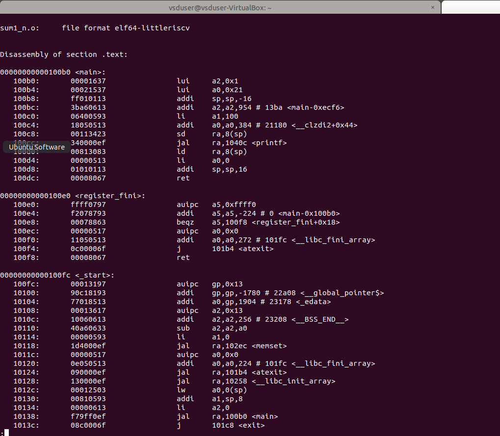
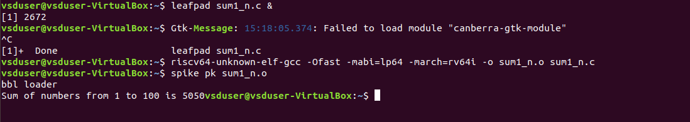
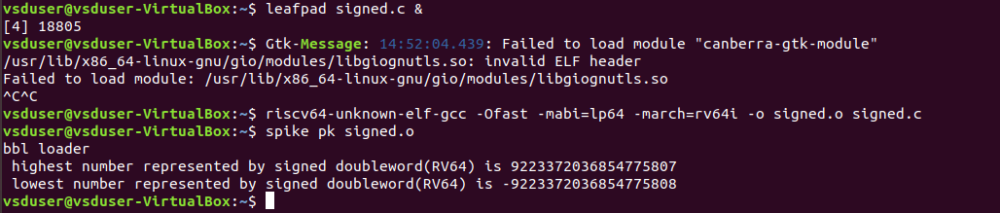

# Day 1 Instruction Set Architecture & GNU Toolchain.
  This was just a warm up of the extensive work we would be doing in the further days. It made us familiar with the VSD-IAT platform and using the lab instances . 
  A brief overview of how the higher level languages are converted to assembly and then into machine/binary format , in a hierarchical level was given
  
  Additionally we learnt about the integer number representation and their maximum and minimum ranges.
  
  - Integer: 
    - Word i.e. 32 bits.
    - Double word i.e 64 bits
    - RV64 has range 0 to (2<sup>64</sup> - 1)
    
  - Negative i.e signed numbers:
    - Range is - 2<sup>63</sup> to (2<sup>63</sup> - 1)
    
    The instructions which work on these numbers are called Base Integer Instruction **RV64I**.
    
## Lab 1 : C program of Sum 1 to n  numbers.
  A basic C program to calculate sum of natural numbers upto a limit provided by the user. The code can be found [here](Codes/sum1_9.c) 
  - Command used to compile the C program is `gcc <filename.c>` or `gcc -o <binary file name> <filename.c>`and to run we use `./a.out` or `./<binary file name>`
  - 
## Lab 2 : C program of Sum 1 to n  numbers, RISC-V toolchain.
  The same C program is now compiled using RISC-V toolchain. 
  - Command used to compile the C program is
    ```
    riscv64-unknown-elf-gcc -O1 -mabi=lp64 -march=rv64i -o sum1_n.o sum1_n.c
    ```
    or
    
    ```
    riscv64-unknown-elf-gcc -Ofast -mabi=lp64 -march=rv64i -o sum1_n.o sum1_n.c
    ```
  - To view to disassemble and view the object file in readable format,we use
    ```
    riscv64-unknown-elf-objdump -d sum1_n.o
    ```
     
    
  - To run we use spike which is a RISC-V simulator, following is the command
    ```
    spike pk sum1ton.o
    ```
  - Spike has a debugging feature too which can be used to run it in steps, following is the command
    ```
    spike -d pk sum1ton.o
    ```
  
  **Output on console**
      

## Lab 3 : Max and Min number representations. 
  A C program is implemented to  show the maximum and minimum sizes for RV64I. The code can be found [here](Codes/signed.c) 
  - Commands used are same as Lab 2

  **Output on console**
  
