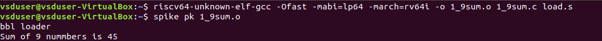
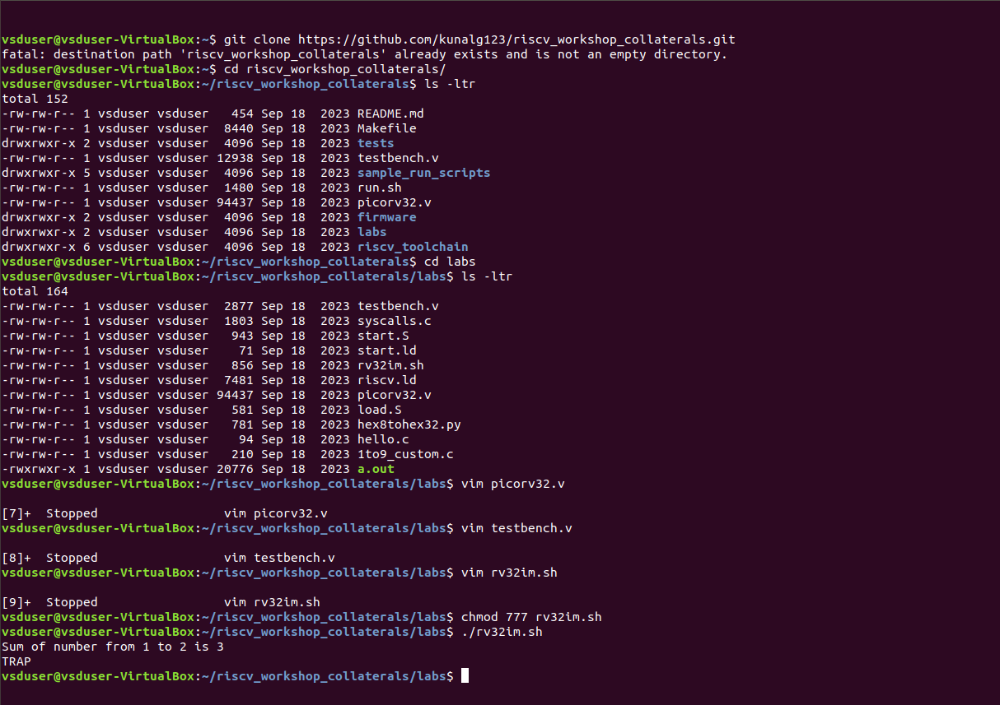

# Day 2 Application Binary Interface and basic verification flow.
  On This day, we delved deep into the lower layers on how the higher layer instructions in c are translated to machine understandable codes. 
  Just like how application program interface (API) is used by application programs to access the standard libraries, an application binary interface or system     call interface is utilised to access hardware resources . The ISA is inherently divided into two parts: *User & System ISA* and *User ISA*  the latter is available to the   user directly by system calls. 
  
  Now, how does the ABI access the hardware resources? 
  - It uses different registers(32 in number) which are each of width `XLEN = 32 bit` for RV32 (~`XLEN = 64 for RV64`) . On a higher level of abstraction these       registers are accessed by their respective ABI names.
  
  For base integer instructions there are broadly 3 types of of such registers:
  - I-type : For instructions having immediate values as operands.
  - R-type : For instructions having only registers as operands.
  - S-type : For instructions used for storing operations.
  
## Lab 1 : ASM & ABI function Calls
  A new program is made by modifying the original `sum1_n.c` and adding ASM and ABI function call .The code can be found [C](codes/sum1_9.c) , [ASM](codes/load.s)
  - Command used to compile the program is
    ```
    riscv64-unknown-elf-gcc -Ofast -mabi=lp64 -march=rv64i -o sum1_9.o sum1_9.c load.S
    ```
  - To view to disassemble and view the object file in readable format, we use
    ```
    riscv64-unknown-elf-objdump -d sum1_9.o|less
    ```
  - To run we use spike which is a RISC-V simulator, following is the command
    ```
    spike pk sum1_9.o
    ```
  
  **Output on console**


## Lab 2 : To run and verify on a RISC-V Core
  An RTL implementation of a RISC-V core has been provided to us and we run the above program using the scripts provided to using iverilog simulator, just to observe  the behaviour of the program in hardware. A similar core would be implemented by us in the next days.
  
  **Output on console**
  
