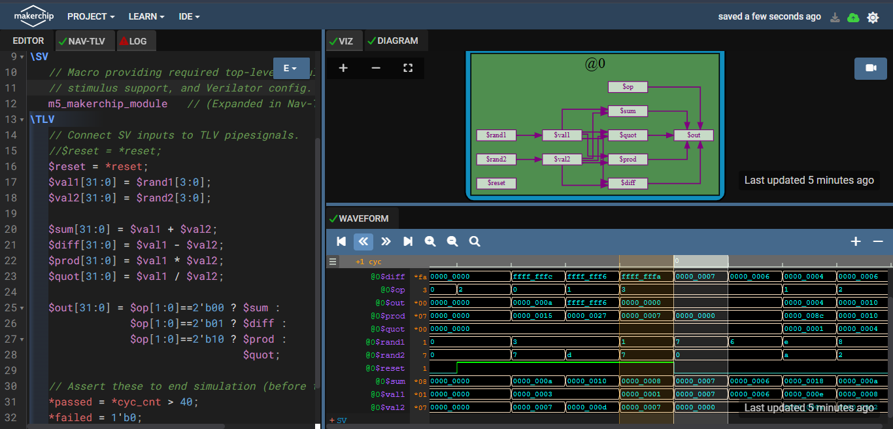
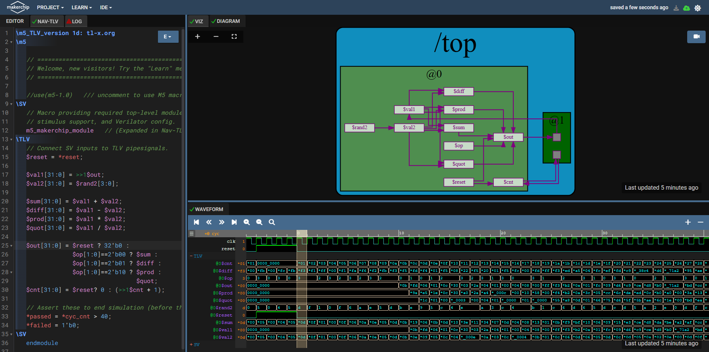
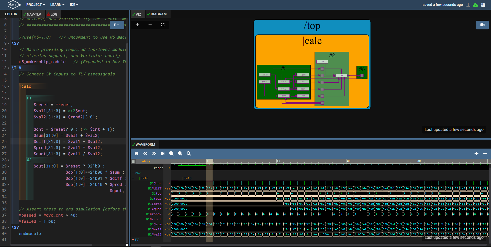
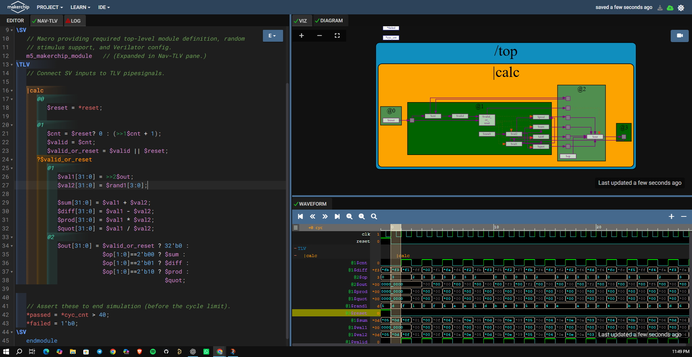

# Day 3 Introduction to TL Verilog and Makerchip.
An introduction to TL-Verilog was done and we implemented basic combinational and sequential logic using the same.This day finally ended with an implementation of a sequential cyclic calculator. Makerchip IDE which is an open source tool developed by Redwood EDA was utilised.

TL-Verilog is an extension for System Verilog, moreover it acts as an higher level abstraction for System verilog which makes HDL implementation very easy and error free. Here we deal the design at a transaction level assuming the design as a pipeline, where inputs would be provided and output will be generated at the end of the pipeline.

Advantages :

* Code reduction , and thus less chances of being bug prone.
* In pipelining ,the flip flops,registers and other staged signals are implied from the context.
* It is very easy to stage different sections without impacting the behaviour of the logic.
* Validity feature which provides easier debugging, cleaner design, automated clock gating and better error checking capabilities.

## Lab 1 : Combinational logic
Signals in TL-Verilog do not need declarations and can directly be used in assignments statements.All the signals start with '$' in TL-Verilog. If a signal is used but never assigned, the ide takes care of assigning random values to those signals. This example describes a combinational logic calculator designed using TL-verilog.

## Lab 2 : Sequential logic
Signals can be preceded with a '>>n' which will provide the value of that signal n cycles before .For example, >>1$num and >>2$num: the previous two values of $num. The use of >>1$num and >>2$num implies staging of $num through two flip-flops. This example describes a two cycle sequential logic calculator designed using TL-verilog.[code](code/seq_cal.tlv)

## Lab 3 : Pipelined logic
Timing abstract powerful feature of TL-Verilog which converts a code into pipeline stages easily. Whole code under |pipe scope with stages defined as @?. This example describes a pipelined calculator designed using TL-verilog.

## Lab 4 : Validity
Validity is TL-verilog means signal indicates validity of transaction and described as "when" scope else it will work as don't care. Denoted as ?$valid. Validity provides easier debug, cleaner design, better error checking, automated clock gating.[code](code/2_cycle_clac_validity.tlv)

