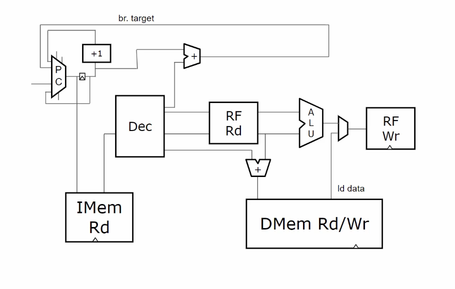
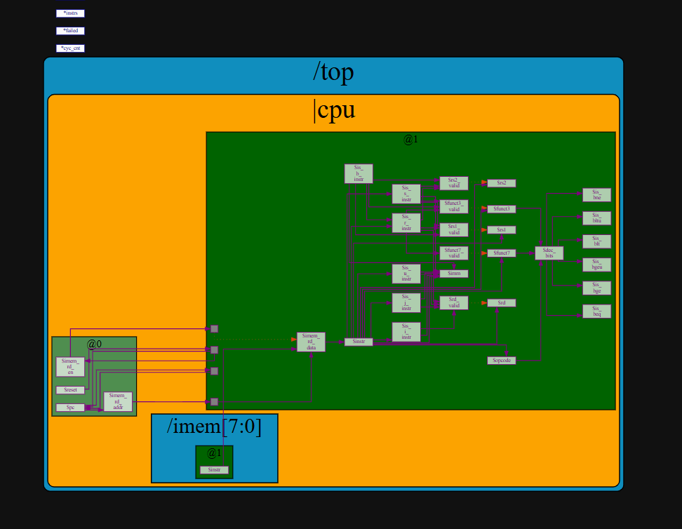
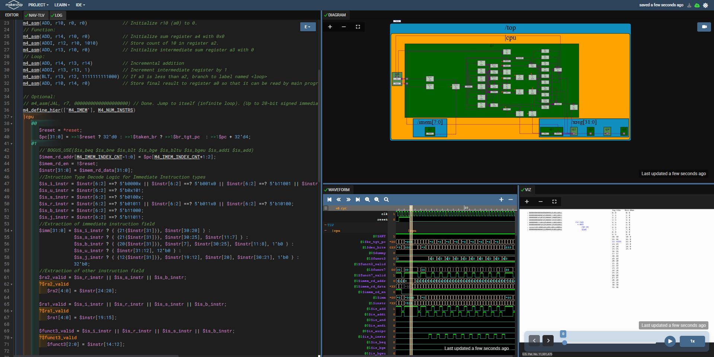
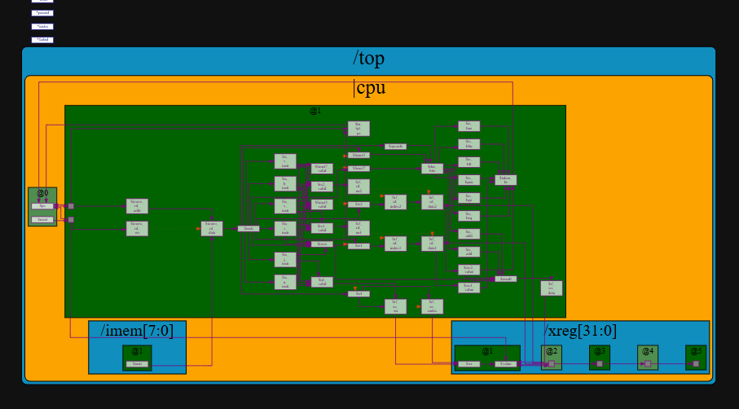
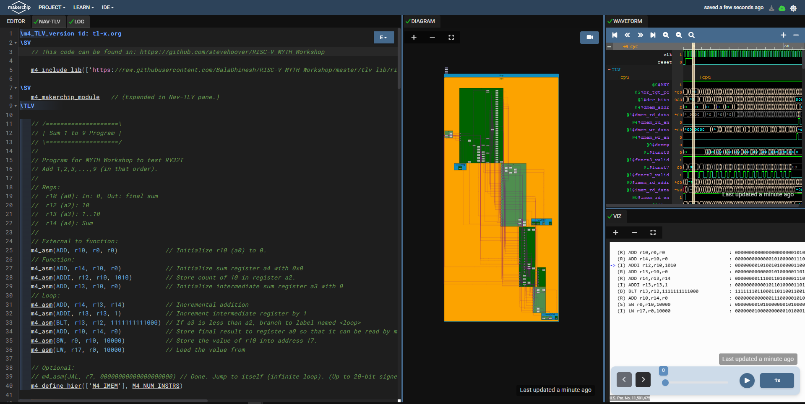
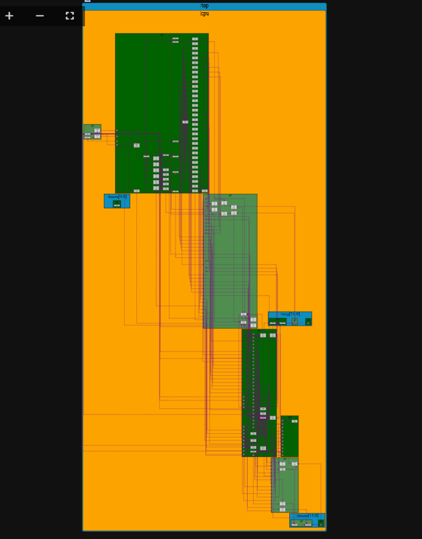

# Day 4 RISC V CPU Core Implementation.
The CPU is divided into different stages like Fetch, Decode and Execute. A single cycle processor is first designed. It is later pipelined by separating the instructions under different @ blocks.

## Lab 1: Program Counter , Fetch  and Decode
The PC (program counter) serves as the address bits for the instruction memory. The program counter needs to be incremented by 4 every cycle since RISC-V architecture follows byte addressing .Instruction memory contains all the instructions. The memory contains 32-bit words which can be read one word at a time. RISC-V follows the little-endian format of memory where the lower order bytes are stored first in the lower.The instruction fetched in the previous state is decoded to identify the type of the instruction.RISC V classifies instructions into  n-basic types namely :- R (Register), I(Immediate), S(Store), B(Branch), U(Upper Immediates), J(Jump). The decoding stage allows the CPU to determine what instruction is to be performed so that the CPU can tell how many operands it needs to fetch in order to perform the instruction

## Lab 2:  Register File Read , ALU 
The Arithmetic and Logic unit unit that carries out all the arithmetic and logic operations on the operands provided and stores the output of the operation in $Result[31:0] signal. During Decode Stage, branch target address is calculated and fed into PC mux. Before Execute Stage, once the operands are ready branch condition is checked.The Register File contains 32 registers as specified by RISC-V ISA and each are named x0-x31. Here the Register file supports 2 Read Operations and 1 Write operation Simultaneously (same clock cycle).

[RISC V core](code/risc_core.tlv)

# Day 5 Pipelined RISC V core
The above single stage Core was enhanced to be staged across 3 stages in a pipeline, Final output where the core is computing Sum of 9 number. Converting non-pipelined CPU to pipelined CPU using timing abstract feature of TL-Verilog. This allows easy retiming wihtout any risk of funcational bugs. More details reagrding Timing Abstract in TL-Verilog can be found in IEEE Paper "Timing-Abstract Circuit Design in Transaction-Level Verilog" by Steven Hoover.

## The complete RV32I core
* A 4 stage RISC V pipelined core, with all the base integer instruction sets was developed.
* For Load and store a Data memory element was added with neccessary instruction decoding logic.
* Register Bypass and Squashing techniques were also incorporated to prevent Read followed by write and branchinghazards, arised due to pipelining.
* Testing of the pipeline design was done in same manner with Load and store incorporated in asm code.
* Additionally Incorporation of Jump feature (JAL and JALR instructions) was also done.The code can be found [here](code/pipelined_risc.tlv).

